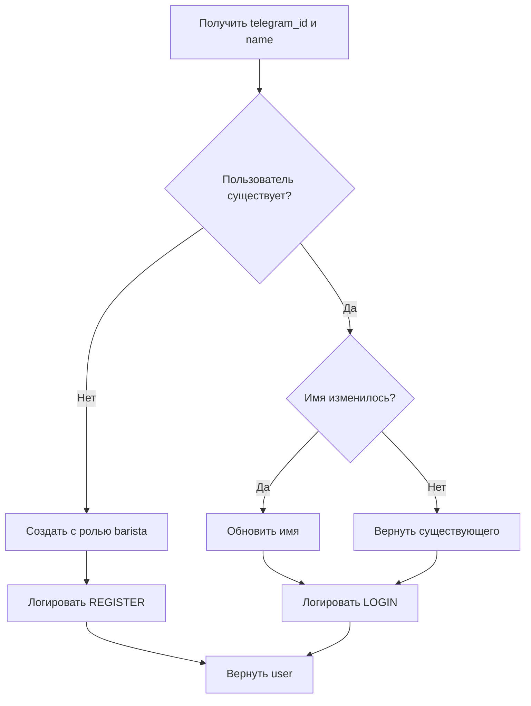

# 🔐 Telegram Auth Edge Function

## Описание

Edge Function для авторизации пользователей через Telegram ID. Автоматически создаёт новых пользователей с ролью `barista`.

---

## 📍 Endpoint

```
POST https://jcrjcglfzrhcghiqfltp.supabase.co/functions/v1/telegram-auth
```

---

## 📥 Request

### Headers
```json
{
  "Content-Type": "application/json",
  "apikey": "YOUR_SUPABASE_ANON_KEY"
}
```

### Body
```json
{
  "telegram_id": 123456789,
  "name": "Иван Петров",
  "username": "ivan_petrov"
}
```

| Поле | Тип | Обязательно | Описание |
|------|-----|-------------|----------|
| `telegram_id` | number | ✅ | ID пользователя в Telegram |
| `name` | string | ✅ | Полное имя пользователя |
| `username` | string | ❌ | Username в Telegram (для логов) |

---

## 📤 Response

### Success (200)

```json
{
  "success": true,
  "user": {
    "id": "550e8400-e29b-41d4-a716-446655440000",
    "telegram_id": 123456789,
    "name": "Иван Петров",
    "role": "barista",
    "created_at": "2025-01-15T10:00:00.000Z"
  }
}
```

### Error (400 / 500)

```json
{
  "success": false,
  "error": "telegram_id и name обязательны"
}
```

---

## 🔄 Логика работы



---

## 🚀 Деплой

### Через Supabase CLI

```bash
# Деплой функции
supabase functions deploy telegram-auth

# Установка секретов (если нужно)
supabase secrets set SUPABASE_URL=https://jcrjcglfzrhcghiqfltp.supabase.co
supabase secrets set SUPABASE_SERVICE_ROLE_KEY=your_service_role_key
```

### Через Dashboard

1. Откройте: https://supabase.com/dashboard/project/jcrjcglfzrhcghiqfltp
2. Перейдите в **Edge Functions**
3. Нажмите **Create Function**
4. Имя: `telegram-auth`
5. Скопируйте код из `index.ts`
6. Нажмите **Deploy**

---

## 🧪 Тестирование

### С помощью curl

```bash
curl -X POST \
  https://jcrjcglfzrhcghiqfltp.supabase.co/functions/v1/telegram-auth \
  -H "Content-Type: application/json" \
  -H "apikey: sb_publishable_55fEkUzyTswveKoQRbyopA_H0Abc7bi" \
  -d '{
    "telegram_id": 123456789,
    "name": "Тест Тестович",
    "username": "test_user"
  }'
```

### В JavaScript

```javascript
const response = await fetch(
  'https://jcrjcglfzrhcghiqfltp.supabase.co/functions/v1/telegram-auth',
  {
    method: 'POST',
    headers: {
      'Content-Type': 'application/json',
      'apikey': 'sb_publishable_55fEkUzyTswveKoQRbyopA_H0Abc7bi',
    },
    body: JSON.stringify({
      telegram_id: window.Telegram.WebApp.initDataUnsafe.user.id,
      name: `${window.Telegram.WebApp.initDataUnsafe.user.first_name} ${window.Telegram.WebApp.initDataUnsafe.user.last_name}`,
      username: window.Telegram.WebApp.initDataUnsafe.user.username,
    }),
  }
);

const data = await response.json();

if (data.success) {
  console.log('Авторизован:', data.user);
  localStorage.setItem('user', JSON.stringify(data.user));
} else {
  console.error('Ошибка:', data.error);
}
```

---

## 🔒 Безопасность

### ✅ Что обеспечено:
- Использует `service_role` key для обхода RLS
- Все новые пользователи создаются с ролью `barista`
- Логирование всех входов в `audit_log`
- CORS настроен для безопасных запросов

### ⚠️ Важно:
- Смена роли на `admin` возможна **только через SQL** администратором
- Нельзя изменить роль через API
- Нельзя удалить пользователя через эту функцию

### Сделать пользователя админом:
```sql
UPDATE users 
SET role = 'admin' 
WHERE telegram_id = 123456789;
```

---

## 📊 Audit Log

Каждый вход записывается в `audit_log`:

```json
{
  "user_id": "uuid",
  "action": "LOGIN" | "REGISTER",
  "table_name": "users",
  "new_data": {
    "telegram_id": 123456789,
    "name": "Иван Петров",
    "username": "ivan_petrov",
    "timestamp": "2025-01-15T10:00:00.000Z"
  }
}
```

---

## 🐛 Troubleshooting

### Ошибка: "relation 'users' does not exist"
Примените миграции из `supabase/migrations/`

### Ошибка: "PGRST116"
Это нормальная ошибка "not found" при первом входе. Функция обрабатывает её автоматически.

### Ошибка: "CORS"
Убедитесь что заголовки CORS настроены правильно в `corsHeaders`.

### Ошибка: "Unauthorized"
Проверьте что используете правильный `apikey` в заголовках.

---

**Создано:** 15 декабря 2025  
**Версия:** 1.0  
**Проект:** Belka Coffee

